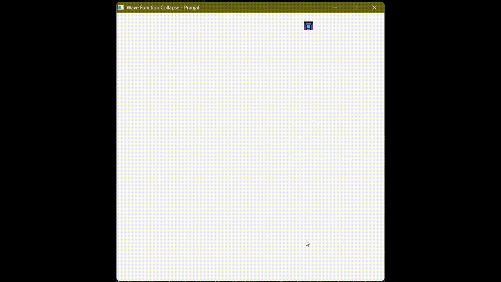
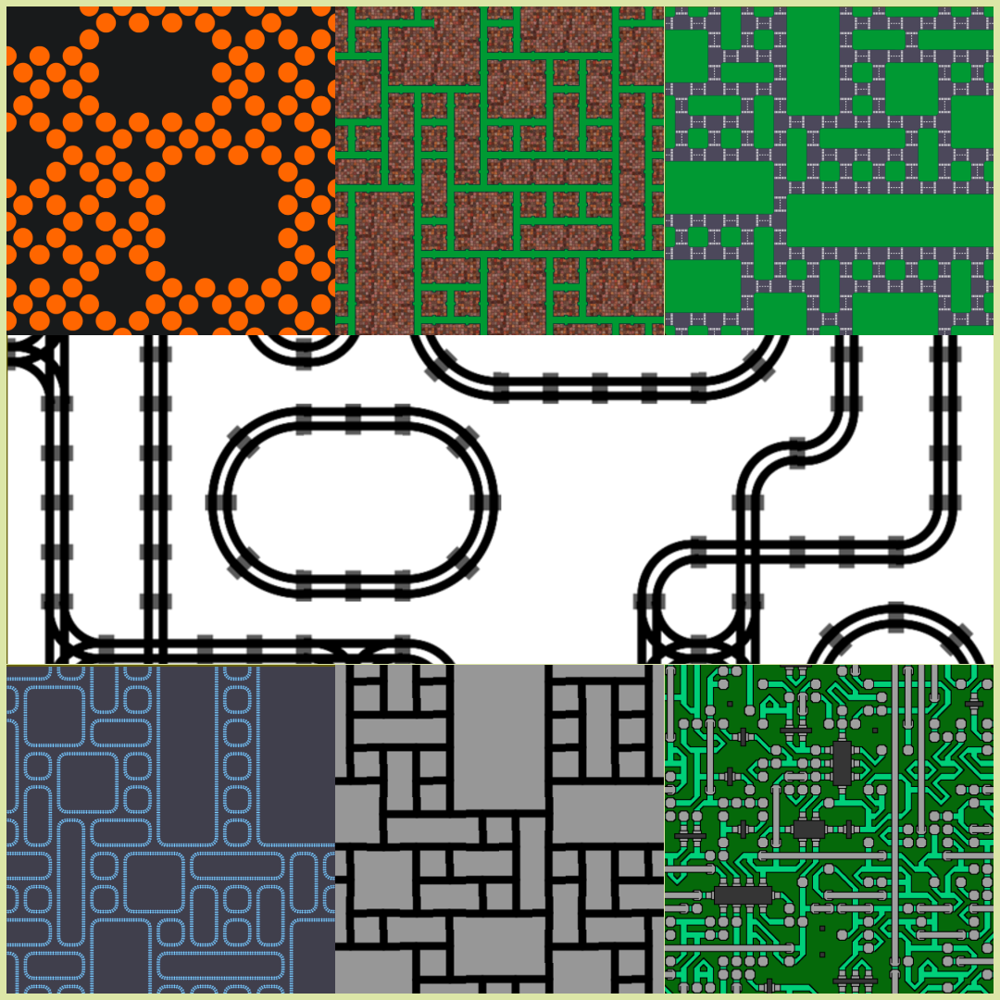

# Wave Function Collapse (WFC) Algorithm

</img> </img>
## Overview
The Wave Function Collapse (WFC) algorithm is a procedural content generation technique inspired by quantum mechanics. This project uses WFC to generate visually appealing patterns and structures such as roads, tracks, and terrains, based on a set of input tiles. The goal is to create varied, yet consistent, output by respecting local constraints between adjacent tiles.

## Project Structure
Here is an overview of the project's directory structure:

```bash
├── images          # Generated images or screenshots  
├── Include         # Header files for the project
├── Libs            # External libraries (Raylib, etc.)
├── Src             # Main source code (main.cpp)
├── Builds          # Folder where your builds will be stored
```

## Build Instructions
To build the project, run the following command in the root directory where the Makefile is located:

```bash
mingw32-make
```
<b>or</b>

```bash
make
```
## Important Notes:
Make sure to run the executable from the parent folder, not the Builds folder, i.e., use ./Builds/app.exe ; Or you can paste the images folder inside your Builds folder.

You may need to compile external dependencies such as [Raylib](www.raylib.com) for your system. Please follow the instructions provided on the Raylib website for your specific platform.
Changing the Scene
The project allows you to modify and explore different scenes. The following images show where you can change the scene and where its definitions are located in the code:

Scene Modification([main.cpp](/Src/main.cpp)):
         
Scene Definitions([constants.h](/Include/constants.h)):
        
## Contributing
Contributions are welcome! Feel free to fork the repository, create a branch, and submit a pull request. We encourage experimentation, so don't hesitate to modify the rules or try out different kinds of input images.

## Acknowledgments
The WFC algorithm is inspired by [The Coding Train's](https://www.youtube.com/@TheCodingTrain) explanation of [Wave Function Collapse](https://www.youtube.com/watch?v=rI_y2GAlQFM).
Special thanks to Raylib for providing the graphics library.

