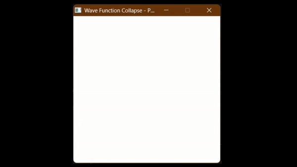

# Wave Function Collapse (WFC)


## Overview
Wave Function Collapse is a procedural content generation algorithm inspired by quantum mechanics. This project implements WFC to generate visually appealing patterns and structures, such as roads, tracks, and terrains, from a set of input tiles.

### Directory Structure
Here’s an overview of the project structure:

```
├── images          # Generated images or screenshots  
├── Include         # Header files for the project 
├── Libs            # External libraries used in the  project (You should compile raylib for your own system by following instructions on their site ) 
├── Src             # main.cpp  
```
## Build Instructions[*](#bottom)
run in terminal in root directory(where makefile is present)

```mingw32-make ``` or ```make```
## Contributing
Contributions are welcome! Feel free to fork the repository, create a branch, and submit a pull request.

## Acknowledgments
Inspired by <a href = "https://www.youtube.com/watch?v=rI_y2GAlQFM">The Coding Train's</a> explanation of Wave Function Collapse.

Thanks to <a href = "https://www.raylib.com/"> Raylib</a> for the graphics library.

P.S.: Feel free to mess around with rules and different kinds of images

<a name="bottom" id="bottom"></a>
*It may take many tries to generate a compelete image as backtracking is not implemented currently 